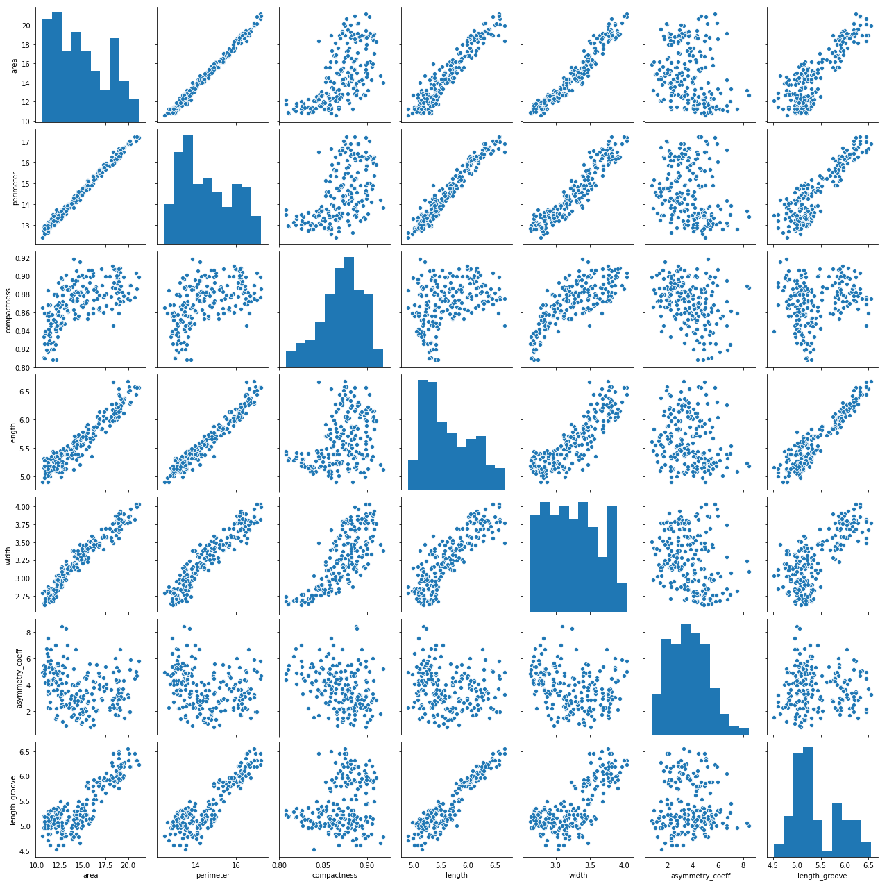
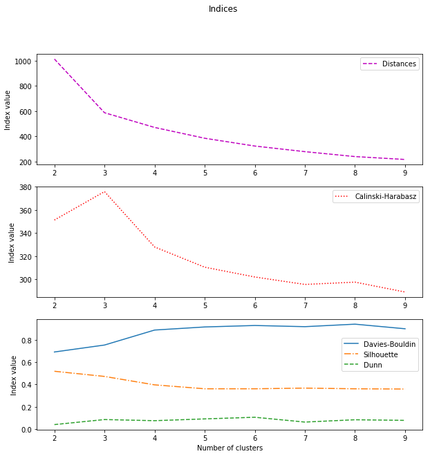
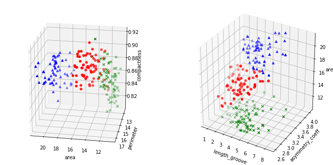
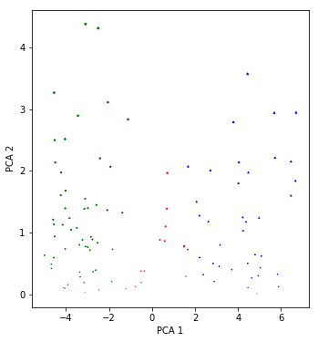

```python
import pandas as pd
from sklearn.cluster import KMeans
from sklearn import metrics
import seaborn as sns
import numpy as np
from mpl_toolkits.mplot3d import Axes3D
import matplotlib.pyplot as plt
```


```python
# load the data into dataframe
seeds = pd.read_csv('seeds_dataset.txt', 
                    sep='\t', 
                    names=['area', 'perimeter', 'compactness', 'length', 'width', 'asymmetry_coeff', 'length_groove', 'label']
                   )
```


```python
# quick look if it came in right
seeds.tail()
```


<div>
<style scoped>
    .dataframe tbody tr th:only-of-type {
        vertical-align: middle;
    }

    .dataframe tbody tr th {
        vertical-align: top;
    }

    .dataframe thead th {
        text-align: right;
    }
</style>
<table border="1" class="dataframe">
  <thead>
    <tr style="text-align: right;">
      <th></th>
      <th>area</th>
      <th>perimeter</th>
      <th>compactness</th>
      <th>length</th>
      <th>width</th>
      <th>asymmetry_coeff</th>
      <th>length_groove</th>
      <th>label</th>
    </tr>
  </thead>
  <tbody>
    <tr>
      <th>205</th>
      <td>12.19</td>
      <td>13.20</td>
      <td>0.8783</td>
      <td>5.137</td>
      <td>2.981</td>
      <td>3.631</td>
      <td>4.870</td>
      <td>3</td>
    </tr>
    <tr>
      <th>206</th>
      <td>11.23</td>
      <td>12.88</td>
      <td>0.8511</td>
      <td>5.140</td>
      <td>2.795</td>
      <td>4.325</td>
      <td>5.003</td>
      <td>3</td>
    </tr>
    <tr>
      <th>207</th>
      <td>13.20</td>
      <td>13.66</td>
      <td>0.8883</td>
      <td>5.236</td>
      <td>3.232</td>
      <td>8.315</td>
      <td>5.056</td>
      <td>3</td>
    </tr>
    <tr>
      <th>208</th>
      <td>11.84</td>
      <td>13.21</td>
      <td>0.8521</td>
      <td>5.175</td>
      <td>2.836</td>
      <td>3.598</td>
      <td>5.044</td>
      <td>3</td>
    </tr>
    <tr>
      <th>209</th>
      <td>12.30</td>
      <td>13.34</td>
      <td>0.8684</td>
      <td>5.243</td>
      <td>2.974</td>
      <td>5.637</td>
      <td>5.063</td>
      <td>3</td>
    </tr>
  </tbody>
</table>
</div>


```python
# check if types were recognized correctly
seeds.dtypes
```


    area               float64
    perimeter          float64
    compactness        float64
    length             float64
    width              float64
    asymmetry_coeff    float64
    length_groove      float64
    label                int64
    dtype: object


```python
# overview of what the data looks like
sns.pairplot(seeds[seeds.columns[:-1]])
```


    <seaborn.axisgrid.PairGrid at 0x7fbcd531ddd8>





```python
# check if basic method works
kmeans = KMeans(n_clusters=16, random_state=0).fit(seeds[seeds.columns[:-1]])
print(kmeans.labels_)
```

    [ 8  8  3  3  8  3  9  3  1  1  9  3  9  3  3  9  9  8  8 13  3  3  8 12
      8  8 13 12  3 13 12  9  9  3  8  1  1  1  9  7  3  3 12  9  9  3  8  9
      3  8  9  5  9  9  8  8  3  8  8 12 12 12 13 13 12 12  8  3  8 13  5  5
      5  6  5  5  5 11 15  1  5 15 11 14 14  6  6  2 11 11 14  2  2 15 15  5
      2  6  6  6  5  6  2  2  2  6  6  5 14  6  6  2  6 15 11  6  2  2  2 14
     11  2  5  6  1  2  2  6 14  5  6  6  9  5  5  9  5  1  1  5  4  7  7  4
      4 10 12  4 13  0  4 10  4  0  0 10  0  4  4  4 13  4  4  4 10 12  4 13
      0  0 10 10  0 10  0  0  0  0 10 12  0  4  4  4  7  0  4  0 10  0  0  0
     13  0 13  4  4  4 13 13  4 12  0  7 13 13  0  7 13  4]


```python
# how many clusters to chose?
# only parameter to make difference here is k
# look at different indices for different k

# dunn index not in sklearn, found at https://github.com/jqmviegas/jqm_cvi
from dunn import dunn, dunn_fast

indices = pd.DataFrame(columns=['number', 'Calinski-Harabasz', 'Davies-Bouldin', 'Silhouette', 'Dunn', 'Distances'])

for i in range(2, 10):
    
    kmeans = KMeans(n_clusters=i, random_state=0).fit(seeds[seeds.columns[:-1]])
    
    ch = metrics.calinski_harabaz_score(seeds[seeds.columns[:-1]], kmeans.labels_)
    db = metrics.davies_bouldin_score(seeds[seeds.columns[:-1]], kmeans.labels_)
    si = metrics.silhouette_score(seeds[seeds.columns[:-1]], kmeans.labels_)
    dn = dunn_fast(seeds[seeds.columns[:-1]], kmeans.labels_)
    di = kmeans.inertia_
    
    indices = indices.append({'number': i,
                              'Calinski-Harabasz': ch,
                              'Davies-Bouldin': db,
                              'Silhouette': si,
                              'Dunn': dn, 
                              'Distances': di}, 
                             ignore_index=True)
```

    /opt/tljh/user/lib/python3.6/site-packages/sklearn/metrics/cluster/unsupervised.py:342: RuntimeWarning: divide by zero encountered in true_divide
      score = (intra_dists[:, None] + intra_dists) / centroid_distances
    /opt/tljh/user/lib/python3.6/site-packages/sklearn/metrics/cluster/unsupervised.py:342: RuntimeWarning: divide by zero encountered in true_divide
      score = (intra_dists[:, None] + intra_dists) / centroid_distances
    /opt/tljh/user/lib/python3.6/site-packages/sklearn/metrics/cluster/unsupervised.py:342: RuntimeWarning: divide by zero encountered in true_divide
      score = (intra_dists[:, None] + intra_dists) / centroid_distances
    /opt/tljh/user/lib/python3.6/site-packages/sklearn/metrics/cluster/unsupervised.py:342: RuntimeWarning: divide by zero encountered in true_divide
      score = (intra_dists[:, None] + intra_dists) / centroid_distances
    /opt/tljh/user/lib/python3.6/site-packages/sklearn/metrics/cluster/unsupervised.py:342: RuntimeWarning: divide by zero encountered in true_divide
      score = (intra_dists[:, None] + intra_dists) / centroid_distances
    /opt/tljh/user/lib/python3.6/site-packages/sklearn/metrics/cluster/unsupervised.py:342: RuntimeWarning: divide by zero encountered in true_divide
      score = (intra_dists[:, None] + intra_dists) / centroid_distances
    /opt/tljh/user/lib/python3.6/site-packages/sklearn/metrics/cluster/unsupervised.py:342: RuntimeWarning: divide by zero encountered in true_divide
      score = (intra_dists[:, None] + intra_dists) / centroid_distances
    /opt/tljh/user/lib/python3.6/site-packages/sklearn/metrics/cluster/unsupervised.py:342: RuntimeWarning: divide by zero encountered in true_divide
      score = (intra_dists[:, None] + intra_dists) / centroid_distances


```python
indices
```


<div>
<style scoped>
    .dataframe tbody tr th:only-of-type {
        vertical-align: middle;
    }

    .dataframe tbody tr th {
        vertical-align: top;
    }

    .dataframe thead th {
        text-align: right;
    }
</style>
<table border="1" class="dataframe">
  <thead>
    <tr style="text-align: right;">
      <th></th>
      <th>number</th>
      <th>Calinski-Harabasz</th>
      <th>Davies-Bouldin</th>
      <th>Silhouette</th>
      <th>Dunn</th>
      <th>Distances</th>
    </tr>
  </thead>
  <tbody>
    <tr>
      <th>0</th>
      <td>2.0</td>
      <td>351.179992</td>
      <td>0.690980</td>
      <td>0.518287</td>
      <td>0.040384</td>
      <td>1011.712345</td>
    </tr>
    <tr>
      <th>1</th>
      <td>3.0</td>
      <td>375.804961</td>
      <td>0.753314</td>
      <td>0.471934</td>
      <td>0.085507</td>
      <td>587.318612</td>
    </tr>
    <tr>
      <th>2</th>
      <td>4.0</td>
      <td>327.855313</td>
      <td>0.887602</td>
      <td>0.396465</td>
      <td>0.075360</td>
      <td>471.003396</td>
    </tr>
    <tr>
      <th>3</th>
      <td>5.0</td>
      <td>310.331840</td>
      <td>0.915267</td>
      <td>0.361323</td>
      <td>0.091359</td>
      <td>385.507292</td>
    </tr>
    <tr>
      <th>4</th>
      <td>6.0</td>
      <td>301.837149</td>
      <td>0.928449</td>
      <td>0.361271</td>
      <td>0.106061</td>
      <td>323.870248</td>
    </tr>
    <tr>
      <th>5</th>
      <td>7.0</td>
      <td>295.382574</td>
      <td>0.917866</td>
      <td>0.367379</td>
      <td>0.062993</td>
      <td>279.517700</td>
    </tr>
    <tr>
      <th>6</th>
      <td>8.0</td>
      <td>297.386545</td>
      <td>0.940332</td>
      <td>0.361192</td>
      <td>0.083766</td>
      <td>240.578354</td>
    </tr>
    <tr>
      <th>7</th>
      <td>9.0</td>
      <td>288.810692</td>
      <td>0.899075</td>
      <td>0.359025</td>
      <td>0.078140</td>
      <td>217.676083</td>
    </tr>
  </tbody>
</table>
</div>


```python
%%time
x = np.array(indices['number'])
Y = np.array(indices[['Calinski-Harabasz', 'Davies-Bouldin', 'Silhouette', 'Dunn', 'Distances']])

fig = plt.figure(figsize=(10, 10))
fig.suptitle('Indices')

ax = fig.add_subplot(3,1,1)
ax.plot(x, Y[:, 4], label='Distances', color='m', linestyle='dashed', linewidth=1.5)
ax.legend()
ax.set_ylabel('Index value')

ax = fig.add_subplot(3,1,2)
ax.plot(x, Y[:, 0], label='Calinski-Harabasz', color='r', linestyle='dotted', linewidth=1.5)
ax.legend()
ax.set_ylabel('Index value')

ax = fig.add_subplot(3,1,3)
ax.plot(x, Y[:, 1], label='Davies-Bouldin', linestyle='solid', linewidth=1.5)
ax.plot(x, Y[:, 2], label='Silhouette', linestyle='dashdot', linewidth=1.5)
ax.plot(x, Y[:, 3], label='Dunn', linestyle='dashed', linewidth=1.5)
ax.legend(bbox_to_anchor=(0.78,0.5))
ax.set_xlabel('Number of clusters')
ax.set_ylabel('Index value')

plt.show()
```





    CPU times: user 435 ms, sys: 4.01 ms, total: 439 ms
    Wall time: 444 ms


Distances show kink at 3 clusters, C-H peaks at 3 clusters, others seem inconclusive but flatten out around the 3 to 4 cluster mark. This seems in line with the information we have going in of having three different types of seeds in the dataset. 


```python
# 'final' configuration
kmeans = KMeans(n_clusters=3, random_state=0).fit(seeds[seeds.columns[:-1]])
```


```python
# what does it look like?
# first combine data and labels
labeled_seeds = np.c_[seeds[seeds.columns[:-1]], kmeans.labels_]

fig = plt.figure(figsize=(12, 6))

# show first angle
ax = fig.add_subplot(121, projection='3d', azim=100, elev=20)

for c, m, l in [('r', 'o', 0), ('b', '^', 1), ('g', 'x', 2)]:
    xs = labeled_seeds[labeled_seeds[:,-1] == l][:, 0]
    ys = labeled_seeds[labeled_seeds[:,-1] == l][:, 1]
    zs = labeled_seeds[labeled_seeds[:,-1] == l][:, 2]
    ax.scatter(xs, ys, zs, c=c, marker=m)

ax.set_xlabel(seeds.columns[0])
ax.set_ylabel(seeds.columns[1])
ax.set_zlabel(seeds.columns[2])
ax.set_title('')

# show second angle
ax = fig.add_subplot(122, projection='3d')

for c, m, l in [('r', 'o', 0), ('b', '^', 1), ('g', 'x', 2)]:
    xs = labeled_seeds[labeled_seeds[:,-1] == l][:, 5]
    ys = labeled_seeds[labeled_seeds[:,-1] == l][:, 4]
    zs = labeled_seeds[labeled_seeds[:,-1] == l][:, 0]
    ax.scatter(xs, ys, zs, c=c, marker=m)

ax.set_xlabel(seeds.columns[6])
ax.set_ylabel(seeds.columns[5])
ax.set_zlabel(seeds.columns[0])
ax.set_title('')

plt.show()
```





```python
kmeans.cluster_centers_
```


    array([[14.64847222, 14.46041667,  0.87916667,  5.56377778,  3.27790278,
             2.64893333,  5.19231944],
           [18.72180328, 16.29737705,  0.88508689,  6.20893443,  3.72267213,
             3.60359016,  6.06609836],
           [11.96441558, 13.27480519,  0.8522    ,  5.22928571,  2.87292208,
             4.75974026,  5.08851948]])


The clustering seems adequate when looking at three dimensional subsets of the data (looking at the full dimensions sure would be nice, but the limitations of the brain and all..). All clusters seem to be reasonably coherent, of similar size (the raw data showed an even thirds split) and exhibit more or less the rounded shape expected from kmeans clustering.

The question remains, if this could be improved on. Two ideas that spring to mind are norming and scaling as well as the somewhat more involved process of principal component analysis. Deeper examination seems beyond the scope of this work, but a brief look should be possible.


```python
# principal component analysis. 
from sklearn.decomposition import PCA

pca = PCA(n_components=5)
_ = pca.fit_transform(seeds[seeds.columns[:-1]])
with np.printoptions(precision=4, suppress=True):
    print('explained variance:', pca.explained_variance_ratio_)
```

    explained variance: [0.8294 0.1636 0.0057 0.001  0.0002]


```python
# given that the first two components explain 99.3% of variance and the first three
# explain 99.9%, it seems logical to look at these two options

# do the transform
pca = PCA(n_components=3)
seeds_pca_three = pca.fit_transform(seeds[seeds.columns[:-1]])
seeds_pca_two = seeds_pca_three[:, 0:2]

# do the clustering
kmeans_pca_two = KMeans(n_clusters=3, random_state=0).fit(seeds_pca_two)
kmeans_pca_three = KMeans(n_clusters=3, random_state=0).fit(seeds_pca_three)

# label the transformed data
seeds_pca_two_labeled = np.c_[seeds_pca_two, kmeans_pca_two.labels_]
seeds_pca_three_labeled = np.c_[seeds_pca_three, kmeans_pca_three.labels_]

# label the original data with the transformed labels
seeds_pca_two_labeled_original = np.c_[seeds[seeds.columns[:-1]], kmeans_pca_two.labels_]
seeds_pca_three_labeled_original = np.c_[seeds[seeds.columns[:-1]], kmeans_pca_three.labels_]
```


```python
# what does 3d PCA clustering look like?
fig = plt.figure(figsize=(12, 6))

# show first angle
ax = fig.add_subplot(121, projection='3d', azim=100, elev=20)

for c, m, l in [('r', 'o', 0), ('b', '^', 1), ('g', 'x', 2)]:
    xs = seeds_pca_three_labeled_original[seeds_pca_three_labeled_original[:,-1] == l][:, 0]
    ys = seeds_pca_three_labeled_original[seeds_pca_three_labeled_original[:,-1] == l][:, 1]
    zs = seeds_pca_three_labeled_original[seeds_pca_three_labeled_original[:,-1] == l][:, 2]
    ax.scatter(xs, ys, zs, c=c, marker=m)

ax.set_xlabel(seeds.columns[0])
ax.set_ylabel(seeds.columns[1])
ax.set_zlabel(seeds.columns[2])
ax.set_title('')

# show second angle
ax = fig.add_subplot(122, projection='3d')

for c, m, l in [('r', 'o', 0), ('b', '^', 1), ('g', 'x', 2)]:
    xs = seeds_pca_three_labeled_original[seeds_pca_three_labeled_original[:,-1] == l][:, 5]
    ys = seeds_pca_three_labeled_original[seeds_pca_three_labeled_original[:,-1] == l][:, 4]
    zs = seeds_pca_three_labeled_original[seeds_pca_three_labeled_original[:,-1] == l][:, 0]
    ax.scatter(xs, ys, zs, c=c, marker=m)

ax.set_xlabel(seeds.columns[6])
ax.set_ylabel(seeds.columns[5])
ax.set_zlabel(seeds.columns[0])
ax.set_title('')

plt.show()
```


```python
# what does 2d PCA clustering look like?
fig = plt.figure(figsize=(12, 6))

ax = fig.add_subplot(121)

for c, m, l in [('r', 'o', 0), ('b', '^', 1), ('g', 'x', 2)]:
    xs = seeds_pca_three_labeled[seeds_pca_three_labeled_original[:,-1] == l][:, 0]
    ys = seeds_pca_three_labeled[seeds_pca_three_labeled_original[:,-1] == l][:, 1]
    zs = seeds_pca_three_labeled[seeds_pca_three_labeled_original[:,-1] == l][:, 1]
    ax.scatter(xs, ys, zs, c=c, marker=m)

ax.set_xlabel('PC 1')
ax.set_ylabel('PC 2')
ax.set_title('')

plt.show()
```





```python
indices_comparison = pd.DataFrame(columns=['method', 'Calinski-Harabasz', 'Davies-Bouldin', 'Silhouette', 'Dunn', 'Distances'])

for attr, value in {'kmeans': kmeans, 'kmeans pca 2d': kmeans_pca_two, 'kmeans pca 3d': kmeans_pca_three}.items():
    ch = metrics.calinski_harabaz_score(seeds[seeds.columns[:-1]], value.labels_)
    db = metrics.davies_bouldin_score(seeds[seeds.columns[:-1]], value.labels_)
    si = metrics.silhouette_score(seeds[seeds.columns[:-1]], value.labels_)
    dn = dunn_fast(seeds[seeds.columns[:-1]], value.labels_)
    di = value.inertia_
    
    indices_comparison = indices_comparison.append({'method': attr,
                                                    'Calinski-Harabasz': ch,
                                                    'Davies-Bouldin': db,
                                                    'Silhouette': si,
                                                    'Dunn': dn, 
                                                    'Distances': di}, 
                                                   ignore_index=True)
```

    /opt/tljh/user/lib/python3.6/site-packages/sklearn/metrics/cluster/unsupervised.py:342: RuntimeWarning: divide by zero encountered in true_divide
      score = (intra_dists[:, None] + intra_dists) / centroid_distances
    /opt/tljh/user/lib/python3.6/site-packages/sklearn/metrics/cluster/unsupervised.py:342: RuntimeWarning: divide by zero encountered in true_divide
      score = (intra_dists[:, None] + intra_dists) / centroid_distances
    /opt/tljh/user/lib/python3.6/site-packages/sklearn/metrics/cluster/unsupervised.py:342: RuntimeWarning: divide by zero encountered in true_divide
      score = (intra_dists[:, None] + intra_dists) / centroid_distances


```python
indices_comparison
```


<div>
<style scoped>
    .dataframe tbody tr th:only-of-type {
        vertical-align: middle;
    }

    .dataframe tbody tr th {
        vertical-align: top;
    }

    .dataframe thead th {
        text-align: right;
    }
</style>
<table border="1" class="dataframe">
  <thead>
    <tr style="text-align: right;">
      <th></th>
      <th>method</th>
      <th>Calinski-Harabasz</th>
      <th>Davies-Bouldin</th>
      <th>Silhouette</th>
      <th>Dunn</th>
      <th>Distances</th>
    </tr>
  </thead>
  <tbody>
    <tr>
      <th>0</th>
      <td>kmeans</td>
      <td>375.804961</td>
      <td>0.753314</td>
      <td>0.471934</td>
      <td>0.085507</td>
      <td>587.318612</td>
    </tr>
    <tr>
      <th>1</th>
      <td>kmeans pca 2d</td>
      <td>375.804961</td>
      <td>0.753314</td>
      <td>0.471934</td>
      <td>0.085507</td>
      <td>569.889890</td>
    </tr>
    <tr>
      <th>2</th>
      <td>kmeans pca 3d</td>
      <td>375.804961</td>
      <td>0.753314</td>
      <td>0.471934</td>
      <td>0.085507</td>
      <td>584.078516</td>
    </tr>
  </tbody>
</table>
</div>


It appears PCA did not make much of a difference to this dataset, if at all.

When looking at the pairplot, it does not appear as if the features are normally distributed. Assessing the true underlying kind of distribution does not seem feasible with the amount of data given. Standardizing does not appear as a good solution then. Normalizing though does not seem problematic and can be tried (scaling all values between 0 an 1).


```python
# normalize the data
seeds_normalized = (seeds-seeds.min())/(seeds.max()-seeds.min())
```


```python
kmeans_normalized = KMeans(n_clusters=3, random_state=0).fit(seeds_normalized[seeds_normalized.columns[:-1]])
```


```python
indices_comparison = pd.DataFrame(columns=['method', 'Calinski-Harabasz', 'Davies-Bouldin', 'Silhouette', 'Dunn', 'Distances'])

for attr, value in {'kmeans normalized': kmeans_normalized}.items():
    ch = metrics.calinski_harabaz_score(seeds[seeds.columns[:-1]], value.labels_)
    db = metrics.davies_bouldin_score(seeds[seeds.columns[:-1]], value.labels_)
    si = metrics.silhouette_score(seeds[seeds.columns[:-1]], value.labels_)
    dn = dunn_fast(seeds[seeds.columns[:-1]], value.labels_)
    di = value.inertia_
    
    indices_comparison = indices_comparison.append({'method': attr,
                                                    'Calinski-Harabasz': ch,
                                                    'Davies-Bouldin': db,
                                                    'Silhouette': si,
                                                    'Dunn': dn, 
                                                    'Distances': di}, 
                                                   ignore_index=True)
```

    /opt/tljh/user/lib/python3.6/site-packages/sklearn/metrics/cluster/unsupervised.py:342: RuntimeWarning: divide by zero encountered in true_divide
      score = (intra_dists[:, None] + intra_dists) / centroid_distances


```python
indices_comparison
```


<div>
<style scoped>
    .dataframe tbody tr th:only-of-type {
        vertical-align: middle;
    }

    .dataframe tbody tr th {
        vertical-align: top;
    }

    .dataframe thead th {
        text-align: right;
    }
</style>
<table border="1" class="dataframe">
  <thead>
    <tr style="text-align: right;">
      <th></th>
      <th>method</th>
      <th>Calinski-Harabasz</th>
      <th>Davies-Bouldin</th>
      <th>Silhouette</th>
      <th>Dunn</th>
      <th>Distances</th>
    </tr>
  </thead>
  <tbody>
    <tr>
      <th>0</th>
      <td>kmeans normalized</td>
      <td>359.002452</td>
      <td>0.778777</td>
      <td>0.453801</td>
      <td>0.019204</td>
      <td>22.024363</td>
    </tr>
  </tbody>
</table>
</div>


```python
# what does 3d PCA clustering look like?
fig = plt.figure(figsize=(12, 6))

seeds_normalized_labeled = np.c_[seeds[seeds.columns[:-1]], kmeans_pca_three.labels_]

# show first angle
ax = fig.add_subplot(121, projection='3d', azim=100, elev=20)

for c, m, l in [('r', 'o', 0), ('b', '^', 1), ('g', 'x', 2)]:
    xs = seeds_normalized_labeled[seeds_normalized_labeled[:,-1] == l][:, 0]
    ys = seeds_normalized_labeled[seeds_normalized_labeled[:,-1] == l][:, 1]
    zs = seeds_normalized_labeled[seeds_normalized_labeled[:,-1] == l][:, 2]
    ax.scatter(xs, ys, zs, c=c, marker=m)

ax.set_xlabel(seeds.columns[0])
ax.set_ylabel(seeds.columns[1])
ax.set_zlabel(seeds.columns[2])
ax.set_title('')

# show second angle
ax = fig.add_subplot(122, projection='3d')

for c, m, l in [('r', 'o', 0), ('b', '^', 1), ('g', 'x', 2)]:
    xs = seeds_normalized_labeled[seeds_normalized_labeled[:,-1] == l][:, 5]
    ys = seeds_normalized_labeled[seeds_normalized_labeled[:,-1] == l][:, 4]
    zs = seeds_normalized_labeled[seeds_normalized_labeled[:,-1] == l][:, 0]
    ax.scatter(xs, ys, zs, c=c, marker=m)

ax.set_xlabel(seeds.columns[6])
ax.set_ylabel(seeds.columns[5])
ax.set_zlabel(seeds.columns[0])
ax.set_title('')

plt.show()
```


This step also appears to be of limited to no value. Sad.


```python

```
